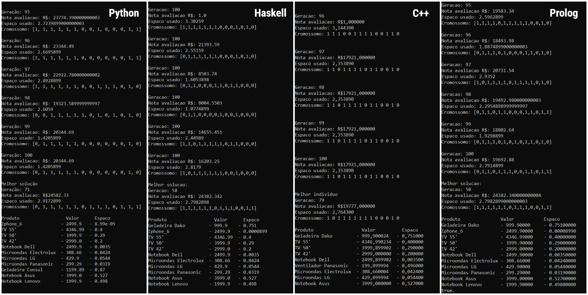

# Genetic Algorithm

O problema a ser resolvido se trata de uma empresa de transporte que possui vários produtos a serem transportados, porém, a empresa possui somente um caminhão disponível e com espaço limitado de armazenamento. O objetivo será desenvolver um algoritmo que consiga gerar a melhor combinação dos produtos que devem ser transportados, levando em consideração o fato de queremos ganhar o máximo de dinheiro possível e ocupando o espaço disponível no caminhão.

